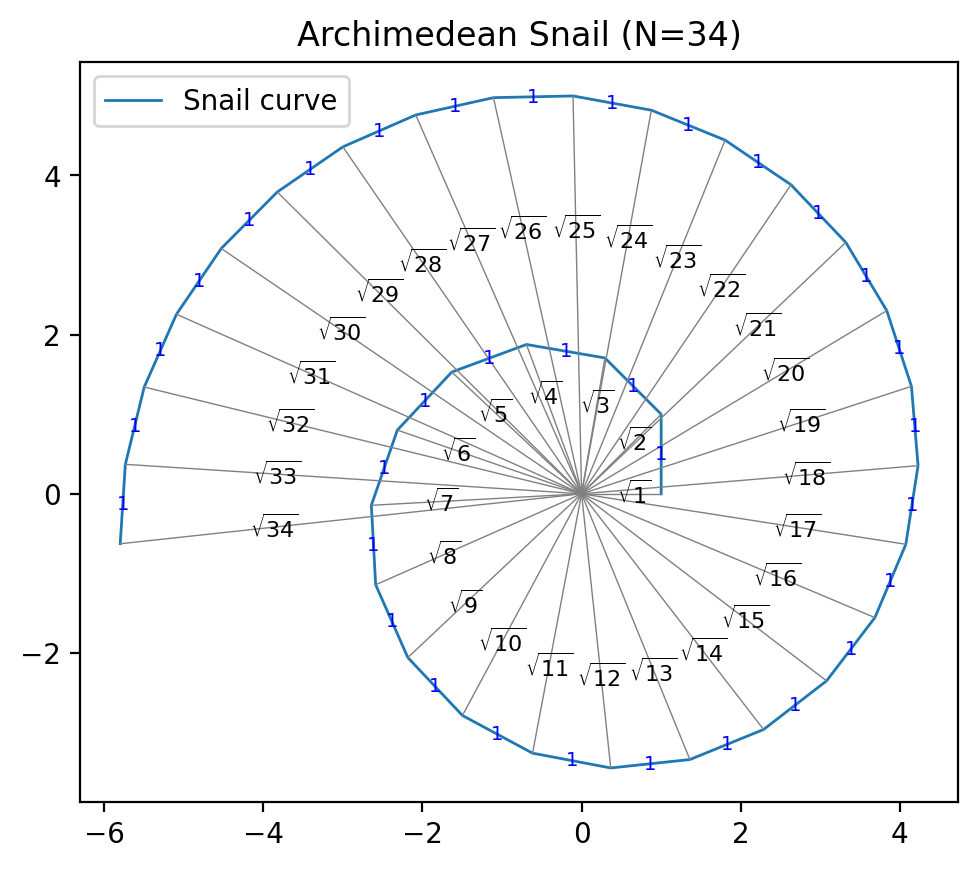

# Archimedean Snail 🐌

**Archimedean Snail** is a Python program that plots the **Spiral of Theodorus**, also known as the square-root spiral.  
It visualizes a sequence of right triangles where each hypotenuse is √n and the legs are connected with unit-length segments.  



---

## Features

- Plots the Spiral of Theodorus (`archimedean snail`)  
- Shows **radial lines** from the origin labeled with √n  
- Labels **unit-length outer lines** with `1`  
- Supports toggling of rays and annotations  
- Automatically saves plots to the `out/` folder  

---

## Installation

1. Clone the repository:  
```bash
git clone https://github.com/<YOUR-USERNAME>/archimedean-snail.git
cd archimedean-snail
```

Create and activate a virtual environment:
```bash
python -m venv .venv
.\.venv\Scripts\Activate.ps1
```

Install dependencies:
```bash
pip install matplotlib numpy
```

Usage
Run the script:
```bash
python src\snail.py [options]
```

Arguments
Argument	Description

```bash
--n <int>	Number of points in the spiral (default: 17)
--no-rays	Hide radial lines from the origin
--no-annotations	Hide all labels (√n on rays and 1 on outer lines)
--outfile <filename>	Save the plot to the results/ folder with the given file name (e.g., --outfile snail.png)
--no-show	Do not display the interactive plot window
```

Examples:

Plot a spiral with 50 points and show everything:

```bash
python src\snail.py --n 50
```

Plot a spiral without rays or annotations and save to file:
```bash
python src\snail.py --n 50 --no-rays --no-annotations --outfile my_spiral.png
```
Notes
All saved plots go automatically to the out/ folder. If the folder does not exist, it will be created automatically.

The program can also be converted to an executable using PyInstaller:

```bash
pyinstaller --onefile src\snail.py
```
